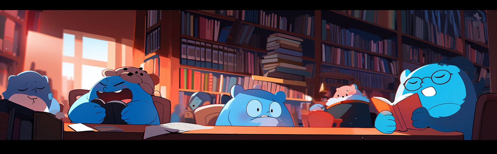

# OpenPair: Golang Intro

Welcome to the "OpenPair: Golang Intro" tutorial! This tutorial is designed to provide you with a fundamental introduction to the Go programming language (Golang). Whether you're new to programming or transitioning from another language, this tutorial will help you grasp the basics of Go.

## Contents

1. **Variables and Data Types**: Learn how to declare and use variables, as well as explore various data types supported by Go.
2. **Constants**: Understand how to declare and use constants in your Go programs.
3. **Control Structures**: Explore conditional statements (if-else) and loops (for) to control the flow of your code.
4. **Functions**: Learn how to define and use functions to organize your code into reusable blocks.
5. **Arrays and Slices**: Dive into arrays and slices, which are essential for working with collections of data.
6. **Maps**: Discover how to work with key-value pairs using Go's map data structure.
7. **Structs**: Explore structs to create custom data types with named fields.
8. **Error Handling**: Understand Go's error handling mechanism to manage exceptional situations.
9. **Defer and Panic**: Learn about the `defer` statement for clean-up tasks and the `panic` function for critical errors.

## Useful Resources

To deepen your understanding of Go and further your learning, here are some useful resources:

- [Official Go Documentation](https://golang.org/doc/): The official documentation provides comprehensive information about the language, packages, and tools.
- [A Tour of Go](https://tour.golang.org/welcome/1): An interactive tour of Go that covers the basics with hands-on coding exercises.
- [Effective Go](https://golang.org/doc/effective_go.html): A guide to writing clear and idiomatic Go code.
- [Go by Example](https://gobyexample.com/): A collection of examples that demonstrate Go's features and concepts.
- [Go Playground](https://play.golang.org/): An online Go environment where you can write and run Go code snippets.
- [Go Forum](https://forum.golangbridge.org/): An active community forum for asking questions and discussing Go-related topics.
